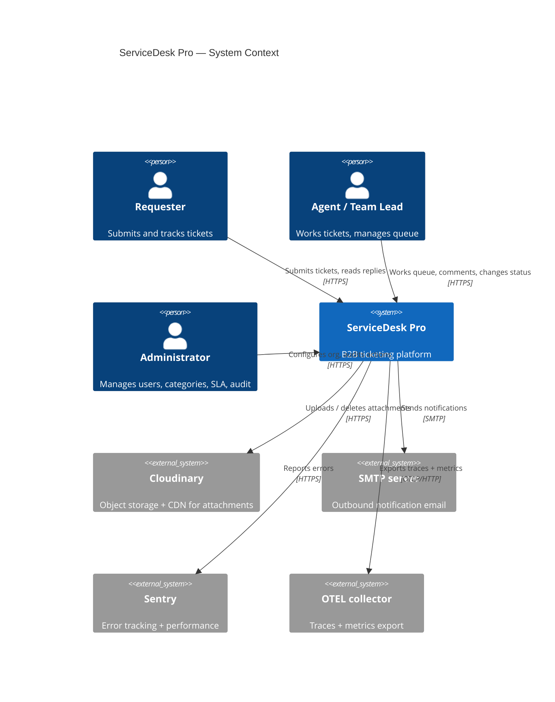
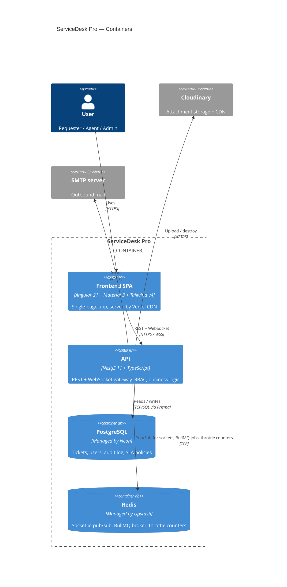

# ServiceDesk Pro — Architecture

This document gives a high-level view of how ServiceDesk Pro is put together.
For deeper rationale on individual decisions see [`adr/`](./adr/).

---

## 1. C4 — Context Diagram



---

## 2. C4 — Container Diagram



---

## 3. Backend module layout

```
backend/src/
├── main.ts                     # bootstrap, helmet, CORS, swagger, shutdown
├── app.module.ts               # global wiring + RequestIdMiddleware + ThrottlerGuard
├── common/
│   ├── filters/                # AllExceptionsFilter (uses req.id)
│   ├── middleware/             # RequestIdMiddleware
│   ├── decorators/             # @CurrentUser, @Roles, @Public
│   └── guards/                 # RolesGuard
├── config/                     # env validation (zod-style)
├── infrastructure/
│   ├── prisma/                 # PrismaService (onModuleInit/Destroy)
│   ├── redis/                  # ioredis singleton (REDIS_CLIENT token)
│   └── cloudinary/             # CloudinaryService (upload + destroy)
├── modules/
│   ├── auth/                   # JWT + refresh tokens, argon2, RBAC
│   ├── users/                  # admin CRUD
│   ├── tickets/                # state machine, comments, assignment
│   ├── attachments/            # upload + magic-bytes validation
│   ├── categories/             # admin CRUD
│   ├── teams/                  # admin CRUD
│   ├── sla/                    # SLA engine + BullMQ recurring scheduler (60s)
│   ├── audit/                  # audit log read API
│   ├── stats/                  # dashboard aggregates
│   ├── reports/                # summary + CSV export
│   ├── notifications/          # in-app notifications (DB) + bell
│   ├── realtime/               # Socket.io gateway, joinTicket rooms
│   ├── mail/                   # nodemailer wrapper
│   ├── health/                 # /health/live + /health/ready (Terminus)
│   └── metrics/                # /metrics (prom-client) + interceptor
└── observability/
    └── otel.ts                 # OpenTelemetry SDK bootstrap
```

### Cross-cutting concerns

| Concern              | Implementation                                                  |
| -------------------- | --------------------------------------------------------------- |
| AuthN                | JWT access (15m) + httpOnly refresh cookie (7d), argon2 hashing |
| AuthZ                | `RolesGuard` (global) + `@Roles(...)` decorator                 |
| Validation           | `class-validator` DTOs, global `ValidationPipe` whitelist+strict|
| Rate limiting        | `@nestjs/throttler` global guard + per-route on auth (5/min)    |
| Correlation id       | `RequestIdMiddleware` → `req.id` → exception filter + pino logs |
| Logging              | `nestjs-pino`, JSON in prod, pretty in dev                      |
| Errors               | `AllExceptionsFilter` → `{ error: { code, message, requestId }}`|
| Health               | Terminus, DB ping + Redis ping                                  |
| Metrics              | Prometheus via `prom-client`, scraped at `/metrics`             |
| Tracing              | OpenTelemetry auto-instrumentation                              |
| Errors (3rd-party)   | Sentry NestJS integration                                       |

---

## 4. Frontend layout

```
frontend/src/app/
├── core/                  # singletons (auth, theme, i18n, realtime, http)
│   ├── auth/              # AuthStore signal + JwtInterceptor + guards
│   ├── theme/             # ThemeStore (dark/light, localStorage)
│   ├── i18n/              # I18nStore + TranslatePipe (en/uk)
│   ├── realtime/          # Socket.io client wrapper
│   └── tickets/           # TicketsStore, TicketsService, types
├── features/              # route-bound pages (lazy-loaded)
│   ├── login/
│   ├── dashboard/
│   ├── tickets/           # list, detail, edit, queue, my-tickets
│   ├── notifications/
│   ├── reports/
│   ├── profile/
│   ├── admin/             # users, categories, teams, sla, audit-log
│   └── not-found/
└── shared/                # reusable presentational + directives
    ├── app-toolbar/
    ├── notifications-bell/
    ├── sla-countdown/
    ├── skeleton/
    ├── directives/        # *hasRole, *hasPermission
    └── pipes/             # timeAgo, slaStatus
```

State management uses **`@ngrx/signals` `signalStore`** (`AuthStore`,
`TicketsStore`, `NotificationsStore`) — composed from `withState`,
`withComputed`, and `withMethods`. Smaller per-feature state lives in plain
`signal()` / `computed()` inside the components themselves.

---

## 5. Request lifecycle (server side)

```
Client request
  └─► RequestIdMiddleware     # assigns req.id
      └─► JwtAuthGuard         # global, skipped for @Public
          └─► RolesGuard       # global, checks @Roles
              └─► ThrottlerGuard  # global, skipped for @SkipThrottle
                  └─► ValidationPipe  # DTO validation
                      └─► Controller / Service
                          └─► PrismaService → PostgreSQL
              ▲
              ├── MetricsInterceptor (records duration + status)
              └── AllExceptionsFilter (catches, formats, logs with req.id)
```

---

## 6. Deployment

| Component  | Provider                | Notes                                               |
| ---------- | ----------------------- | --------------------------------------------------- |
| Frontend   | Vercel                  | Auto-deploy from `main`, preview deploys per PR     |
| API        | Render (Web Service)    | Auto-deploy from `main`, health-checked at `/ready` |
| PostgreSQL | Neon (managed)          | Branching enabled for previews                      |
| Redis      | Render (managed)        | Used for sockets pub/sub + throttle counters        |
| Files      | Cloudinary              | Free tier                                           |
| Mail       | Mailtrap (dev) / SES    | Switched via `SMTP_*` env vars                      |
| Errors     | Sentry                  | DSN via `SENTRY_DSN`                                |

See [`DEPLOY.md`](../DEPLOY.md) for the operational runbook.
